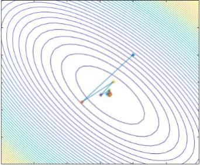

<h1 align="center">Course: Convex Optimization </h1>

## Course Information
Instructor: [Niao He](http://people.inf.ethz.ch/niaohe/index.html)

### Course Description
> This course is focused on learning to recognize, understand,
analyze, and solve unconstrained and constrained convex optimization problems arising in engineering. The course shall focus on the fundamental convexity theory and the algorithmic approaches for nondifferentiable convex problems. It shall start with the theory of convex sets and convex functions, and their properties. The exposure to this theory is tailored to the level necessary for understanding the crucial aspects of constrained convex optimization problems,
including existence of solutions, primal-dual properties, and zero duality gap
conditions. All of these aspects will come to play an important role in the
subsequent study of the fundamental and the state-of-art algorithmic approaches
for nondifferentiable convex problems, and in the analysis of the quality of the algorithmic solutions. The course shall keep strong emphasis on practical applications, by providing numerous examples of convex optimization problems such as least-squares, linear and quadratic optimization, semidefinite programming, minimax problems, and some convex problems with special structures. The application areas include machine learning, image/signal processing, financial engineering, operations management and others. 
>
> *Courtesy warning*: The course is intended for students who wish to gain an in-depth understanding of the convex analysis, modern disciplined convex programming, and hence places emphasis on theory and rigorous proofs. Students looking for introductory knowledge and/or more practical experience with optimization should consider instead [ECE 490 (Introduction to Optimization)](https://sites.google.com/site/ece490spring2017/). Students looking for advanced topics in large-scale optimization should consider IE [598NH (Big Data Optimization)](http://niaohe.ise.illinois.edu/IE598_2016/). Students looking for more specific topics in optimization applications are encouraged to check the following courses CS 544 (Optimization in Computer Vision), ECE 580 (Optimization by Vector Space Methods), IE 598 (Optimization for Deep Learning).

### Prerequisite
Students are expected to have strong knowledge of linear algebra, real analysis, and multivariate calculus.

### Textbook
No textbook is required, but you can refer to my past lecture notes: [IE521-cvxopt-lecturenotes-sp17.pdf](http://people.inf.ethz.ch/niaohe/IE521/IE%20521-convex%20optimization-lecture%20notes-sp17.pdf)

#### Reference books
Some of the course material is covered in for following books:

1. Boyd & Vandenberghe. [Convex Optimization](http://web.stanford.edu/~boyd/cvxbook/). Cambridge University Press. 2003
2. Ben-Tal & Nemirovski. [Lectures on Optimization III: Convex Analysis, Nonlinear Programming Theory, Nonlinear Programming Algorithms](http://www2.isye.gatech.edu/~nemirovs/OPTIII_LectureNotes2015.pdf), SIAM. 2013
3. Bertsekas, Nedich, & Ozdaglar. [Convex Analysis and Optimization](http://www.athenasc.com/convexity.html). Athena Scientific. 2003   
4. Hiriant-Urruty & Lemarechal. [Fundamentals of Convex Analysis](http://link.springer.com/book/10.1007%2F978-3-642-56468-0). Springer. 2001
5. Ben-Tal & Nemirovski. [Lectures on Modern Convex Optimization](http://www2.isye.gatech.edu/~nemirovs/Lect_ModConvOpt.pdf), SIAM. 2011
6. Nesterov. [Introductory Lectures on Convex Optimization: A Basic Course](http://citeseerx.ist.psu.edu/viewdoc/download?doi=10.1.1.693.855&rep=rep1&type=pdf). Kluwer-Academic. 2003

### Grading Policy
Grades will be based on

- **Homework (60%)**: approximately biweekly on Wednesdays. You are encouraged to discuss homework problems with your fellow students. But your final answers should be based on your own understanding and written in Latex. No late submission is acceptable.
- **Final Exam or Project (40%)**: Check the final exam schedule here: https://registrar.illinois.edu/spring-2019-non-combined-scheduling-guidelines/ You can opt out of the final exam by completing a course project. The project must be related to optimization, and cannot be your own research with your advisor or your other course projects. You will need to turn in a written report with at least 10 pages. Your grade will be evaluated based on the quality of the project and the report.

### Topical Outlines

- Part I: Fundamentals of Convex Analysis (4 weeks): convex sets, convex functions, convex programs, geometry of convexity, Lagrangian duality, optimality condition, and polynomial solvability of convex programming, etc.
- Part II: Modern Convex Optimization (4 weeks): linear program, second order conic program, semidefinite program, interior point method, etc.

- Part III: Algorithms for Non-differential Constrained Convex Programs (4 weeks): subgradient method, cutting plane method, bundle method, etc.

- Part IV: Selective Topics (2 weeks)

### Class Schedule

| Lecture | Date | Topic | Content | Resources |
| :-----: | :---: | :-----: | :-------: | :---------: |
| 0 | January 14th  |  Introduction | Introduction to the Course;  |  |
| 1 | January 16th  |  Convex Set | Topology Review; Convex Sets (definition, convex/conic/affine hulls, examples, calculus of convex sets); Nice Topological Properties of Convex Sets (interior, closure, relative interior); Carathodory's Representation Theorem | [[Slides](./lecture_slides/IE521-lecture-1-convex-sets.pdf)] |
| 2 | January 23th  |  Convex Geometry | Radons Theorem; Helleys Theorem and Applications; Separation Theorems | [[Slides](./lecture_slides/IE521-lecture-2-convex-geometry.pdf)] |
| 3 | January 28th  |  Separation Theorems | Separation Hyperplane Theorem; Strong Separation Hyperplane Theorem; Farkas Lemma; Duality of Linear Programming | [[Slides](./lecture_slides/IE521-lecture-3-separation-theorems.pdf)] |
| 4 | February 4th  |  Convex Functions | Convex Functions (definition, examples, calculus) | [[Slides](./lecture_slides/IE521-lecture-4-convex-functions.pdf)] |
| 5 | February 6th  |  Convex Functions II | Characterizations of Convex Functions (epigraph, level set, first-order and second-order conditions); Continuity and Local Lipschitz Continuity of Convex Functions; Closed Convex Functions | [[Slides](./lecture_slides/IE521-lecture-5-convex-functions-II.pdf)] |
| 6 | February 11th  |  Subgradient and Subdifferential | Subgradient (definition, examples, properties); Directional Derivative and Subdifferential Set; Calculus of Subgradient | [[Slides](./lecture_slides/IE521-lecture-6-subgradients.pdf)] |
| 7 | February 13th  |  Convex Conjugate | Conjugate Function (definition, examples, properties); Conjugate Theory; Minima of Convex Functions | [[Slides](./lecture_slides/IE521-lecture-7-convex-conjuate.pdf)] |
| 8 | February 18th  |  Convex Programs and Duality | Convex Programs; Convex Theorem on Alternatives; Lagrange Duality | [[Slides](./lecture_slides/IE521-lecture-8-convex-programs-and-duality.pdf)] |
| 9 | February 20th  |  Optimality Conditions | KKT Conditions; Saddle Point Perspective; Minimax Theorems | [[Slides](./lecture_slides/IE521-lecture-9-optimality-conditions.pdf)] |
| 10 | February 25th  |  Solving Convex Programs | Accuracy Measure, Oracles, Complexity; Cutting Plane Methods; Center of Gravity Algorithm | [[Slides](./lecture_slides/IE521-lecture-10-solving-convex-programs.pdf)] |
| 11 | February 27th  |  Ellipsoid Method and Polynomial Solvability of Convex Programs | Complexity vs Convergence; Center of Gravity; Ellipsoid Method | [[Slides](./lecture_slides/IE521-lecture-11-ellipsoid-method.pdf)] |
| 12 | March 4th  |  Conic Programming | Generalized Inequality; Conic Programs: LP, SOCP, SDP; Applications: norm minimization, sparse group lasso, robust linear program | [[Slides](./lecture_slides/IE521-lecture-12-conic-programs.pdf)] |
| 13 | March 6th  |  Conic Duality | Dual Cone (definition, properties, self-dual cones); Conic Duality (strong duality, optimality conditions); SOCP Duality; SDP Duality and Applications | [[Slides](./lecture_slides/IE521-lecture-13-conic-duality.pdf)] |
| 14 | March 11th  |  SDP Relaxation and Applications | SDP for Eigenvalue Optimization; SDP for Max Cut Problem (GW Theorem and Nesterovs Theorem); SDP for Nonconvex QCQP; SDP for Stability of Dynamical Systems | [[Slides](./lecture_slides/IE521-lecture-14-SDP-relaxation.pdf)] |
| 15 | March 13th  |  CVX Tutorial | CVX Tutorial; MATLAB Demonstration; ; No Class during Spring Break (March 18th - March 22nd ); ; Midterm Exam is on Wednesday, March 28th;  | [[Slides](./lecture_slides/IE521-lecture-15-CVX-tutorial.pdf)] |
| 16 | April 1st  |  Interior Point Method  Part I | Path Following Scheme; Self-concordant Functions (definition, examples, calculus, geometric properties);  | [[Slides](./lecture_slides/IE521-lecture-16-IPM-self-concordance.pdf)] |
| 17 | April 5th  |  Interior Point Method  Part II | Classical Newton Method and Analysis; Newton Method for Self-concordant Functions; Damped Newton Method and Global Convergence | [[Slides](./lecture_slides/IE521-lecture-17-IPM-Newton-method.pdf)] |
| 18 | April 10th  |  Interior Point Method  Part III | Self-concordant Barriers; Restate Path Following Scheme | [[Slides](./lecture_slides/IE521-lecture-18-IPM-path-following-scheme.pdf)] |
| 19 | April 15th  |  Interior Point Method  Part IV | Self-concordant Barriers for LP, SOCP, SDP; Complexity of Interior Point Method; Primal-Dual Path Following Scheme;  | [[Slides](./lecture_slides/IE521-lecture-19-IPM-conic-programs.pdf)] |
| 20 | April 17th  |  Subgradient Method | Subgradient Method; Choices of Stepsize; Convergence Analysis;  | [[Slides](./lecture_slides/IE521-lecture-20-subgradient-method.pdf)] |
| 21 | April 22th  |  Bundle Methods | Kelleys Method; Level Set Method;  | [[Slides](./lecture_slides/IE521-lecture-21-bundle-methods.pdf)] |
| 22 | April 24th  |  Constrained Subgradient Methods | Problems with Functional Constraints; Constrained Level Method; Lower Bound Complexity | [[Slides](./lecture_slides/IE521-lecture-22-constrained-subgradient-methods.pdf)] |
| 23 | April 29th | Dual Methods | Augmented Lagrangian; ADMM | [[Slides](./lecture_slides/IE521-lecture-23-dual-methods.pdf)] |

## License
